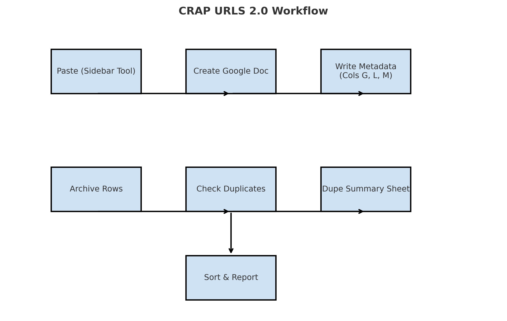

# CRAP URLS 2.0 – Google Apps Script

## Overview  
This Google Apps Script automates article handling within the **CRAP URLS 2.0** Google Sheet.  
It adds custom menu tools for creating Google Docs, archiving rows, detecting duplicates, and generating summary reports.

---

## Features  
- **Sidebar Paste Tool**  
  - Paste article content from clipboard into a Google Doc.  
  - Uses the **Article Title (Col C)** as the Doc title.  
  - Stores Doc Title (Col L), Doc URL (Col M), and updates Status (Col G).  
  - Docs are saved to a specified Drive folder.

- **Archiving**  
  - Moves rows where **Column F = “Yes”** into the *Archive of CRAP URLS 2.0* tab.  
  - Skips header and template rows.

- **Duplicate Detection**  
  - Checks both **Article URL (Col B)** and **Article Title (Col C)**.  
  - Labels entries as:  
    - `Original` – first occurrence by timestamp.  
    - `Dupe-Title` – duplicate by title only.  
    - `Dupe-URL` – duplicate by URL only.  
    - `Dupe-Both` – duplicate by both.  
  - Flags duplicate rows with light red highlighting.  
  - Builds a *Dupe Summary* sheet with details.

- **Sort & Report**  
  - Sorts rows by **Status (Col G)**.  
  - Reports record counts for:  
    - `JSON_Shelled`  
    - `Manual`  
    - `Ready to Scrape`  
    - `Ready for Make`  
    - Total Records  

---

## Workflow Diagram  

  

---

## Menu Options  
When the spreadsheet opens, a custom menu **Article Tools** is added with:  
- **Paste Clipboard to Google Doc** → Opens sidebar for content entry.  
- **Archive Rows** → Moves flagged rows to Archive sheet.  
- **Check for Duplicates** → Scans sheet + archive, applies labels, builds summary.  
- **Sort and Report** → Sorts by status and generates counts.

---

## Setup  
1. Open the script editor in your Google Sheet (**Extensions → Apps Script**).  
2. Paste in the provided code.  
3. Ensure the following tabs exist:  
   - `CRAP URLS 2.0` (main working sheet)  
   - `Archive of CRAP URLS 2.0` (archive storage)  
4. Update the **Drive Folder ID** in `createDocFromSidebar()` to match your Google Drive folder.  
5. Reload the Sheet to activate the **Article Tools** menu.

---

## Version History  
- **8.25.25** – Added duplicate checking for both URL and Title (Cols B & C).  
- **6.4.25** – Limited dupe search to Title only; aborts if Google Doc not created.  
- **5.24.25** –  
  - Dupe logic adjusted: only latter records labeled; earliest set to *Original*.  
  - `createDocFromSidebar` no longer alters Col B or C.  
- **5.23.25** – Fixed handling of Col C (Article Title).  
- **5.22.25** – Improved dupe checking stability.  
- **5.17.25** – Added Sort and Report; fixed dupe count accuracy.  
- **5.14.25** – Expanded dupe checking and reporting.  

---

## Notes  
- Always keep **Article Title (Col C)** populated before creating Docs.  
- Archived records are still included in duplicate checks.  
- Summary sheet is rebuilt each time duplicates are checked.  
